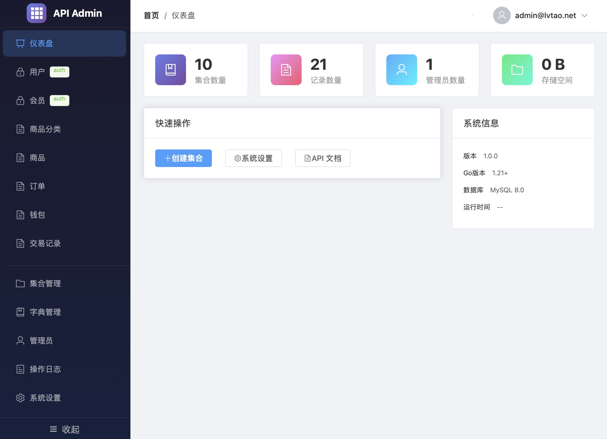
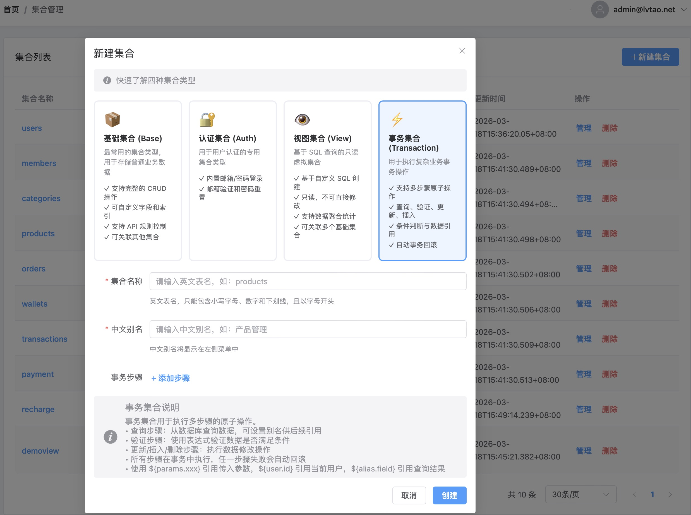

# GO-API-ADMIN
> 一个类似 PocketBase 的轻量级后端即服务（BaaS）平台
>🚀 无代码/低代码数据管理 | 📦 动态集合创建 | 🔐 内置认证系统 | 🎨 现代化管理后台




---

## 📖 项目简介

**GO-API-ADMIN** 是一个基于 Go + Vue 构建的后端即服务平台，提供动态数据管理、API 自动生成和后台管理功能。无需编写代码即可快速构建 API 服务，适合快速开发中小型应用的 API 后端。

### ✨ 核心特性

- 🔥 **零配置启动** - 开箱即用，快速启动服务
- 📊 **动态集合管理** - 支持四种集合类型：基础集合、认证集合、视图集合、事务集合
- 🛠️ **可视化字段配置** - 20+ 种字段类型，支持丰富的验证规则
- 🔐 **内置认证系统** - 支持 JWT 认证、邮箱验证、密码重置
- 🎯 **API 规则引擎** - 细粒度的 API 访问权限控制
- 📡 **自动生成 API** - 集合创建后自动生成 RESTful API
- 🎨 **现代化管理后台** - Vue 3 + Element Plus 构建的响应式界面
- 💾 **数据备份恢复** - 支持一键备份和恢复
- 📝 **操作日志审计** - 完整的操作日志记录
- 🚀 **单文件部署** - 支持静态文件嵌入，一个二进制文件即可运行

---

## 🏗️ 技术栈

### 后端

| 技术 | 版本 | 说明 |
|------|------|------|
| [Go](https://golang.org/) | 1.25+ | 主要编程语言 |
| [Gin](https://github.com/gin-gonic/gin) | v1.9.1 | Web 框架 |
| [GORM](https://gorm.io/) | v1.25.5 | ORM 框架 |
| [MySQL](https://www.mysql.com/) | - | 主数据库 |
| [JWT](https://github.com/golang-jwt/jwt) | v5.3.1 | 认证令牌 |
| [Viper](https://github.com/spf13/viper) | v1.18.2 | 配置管理 |
| [Zap](https://github.com/uber-go/zap) | v1.26.0 | 日志系统 |
| [MinIO](https://min.io/) | v7.0.99 | 对象存储 |

### 前端

| 技术 | 版本 | 说明 |
|------|------|------|
| [Vue.js](https://vuejs.org/) | 3.4+ | 前端框架 |
| [Vue Router](https://router.vuejs.org/) | 4.2+ | 路由管理 |
| [Pinia](https://pinia.vuejs.org/) | 2.1+ | 状态管理 |
| [Element Plus](https://element-plus.org/) | 2.4+ | UI 组件库 |
| [Vite](https://vitejs.dev/) | 5.0+ | 构建工具 |
| [Axios](https://axios-http.com/) | 1.6+ | HTTP 客户端 |

---

## 🚀 快速开始

### 环境要求

- Go 1.25+
- Node.js 18+
- MySQL 5.7+
- Make（可选）

### 安装运行

```bash
# 克隆项目
git clone https://github.com/lvtao-net/go-api-admin.git
cd go-api-admin

# 安装前端依赖
cd web && npm install && cd ..

# 配置数据库（复制模板并修改）
cp config.yaml.example config.yaml
# 编辑 config.yaml，填入你的数据库配置和 JWT 密钥

# 运行项目
go run ./cmd/server/.
```

访问 http://localhost:3000 进入管理后台UI
访问 http://localhost:8099 后台API路径

### 构建部署

```bash
# 开发模式运行
make run

# 构建本地版本
make build-local

# 构建嵌入静态文件版本（单文件部署）
make build-embed

# 构建多平台生产版本
make build

# Docker 部署
make docker-build
make docker-run
```

---

## 📁 目录结构

```
go-gin-api-admin/
├── cmd/                          # 入口程序
│   ├── server/main.go            # 主服务入口
│   └── demo_shop/                # 商城演示项目
├── internal/                     # 内部代码
│   ├── config/                   # 配置管理
│   ├── embed/                    # 静态文件嵌入
│   ├── handler/                  # HTTP 处理器
│   ├── middleware/               # 中间件
│   ├── model/                    # 数据模型
│   ├── repository/               # 数据仓库
│   ├── router/                   # 路由配置
│   ├── service/                  # 业务服务
│   └── transaction/              # 事务引擎
├── pkg/                          # 公共包
│   ├── auth/                     # JWT 认证
│   ├── backup/                   # 备份工具
│   ├── database/                 # 数据库连接
│   ├── logger/                   # 日志工具
│   ├── mail/                     # 邮件发送
│   ├── response/                 # 响应封装
│   ├── rule/                     # 规则引擎
│   ├── storage/                  # 存储服务
│   └── validator/                # 验证规则
├── web/                          # 前端项目
│   ├── src/
│   │   ├── api/                  # API 接口
│   │   ├── router/               # 路由配置
│   │   ├── stores/               # 状态管理
│   │   └── views/                # 页面组件
│   └── package.json
├── uploads/                      # 上传文件目录
├── config.yaml                   # 配置文件
├── go.mod                        # Go 模块定义
└── Makefile                      # 构建脚本
```

---

## 📚 功能详解

### 集合类型

| 类型 | 说明 | 适用场景 |
|------|------|----------|
| **基础集合** | 支持完整 CRUD 操作 | 商品、文章、订单等常规数据 |
| **认证集合** | 专用用户认证集合 | 用户注册、登录、权限管理 |
| **视图集合** | 基于 SQL 的虚拟集合 | 多表关联查询、数据统计 |
| **事务集合** | 多步骤事务操作 | 复杂业务逻辑编排 |

### 字段类型

| 类型 | 说明 | 类型 | 说明 |
|------|------|------|------|
| text | 文本 | number | 数字 |
| bool | 布尔 | email | 邮箱 |
| url | URL | date | 日期 |
| select | 下拉选择 | radio | 单选 |
| checkbox | 多选 | relation | 关联 |
| file | 文件 | editor | 富文本 |
| json | JSON | password | 密码 |

### 验证规则

**基础规则**: `required`

**格式规则**: `email`, `phone`, `url`, `idcard`, `ip`, `ipv4`, `ipv6`

**类型规则**: `number`, `integer`, `positive`, `negative`

**字符规则**: `alpha`, `alphanum`, `chinese`

**日期规则**: `date`, `datetime`

**长度规则**: `min_length`, `max_length`, `range_length`

**范围规则**: `min_value`, `max_value`, `range_value`

**安全规则**: `password_strength`

**特殊规则**: `credit_card`, `wechat`, `qq`, `bank_card`, `hex_color`, `json`, `uuid`

---

## 🔌 API 文档

### 公开接口

| 方法 | 路径 | 说明 |
|------|------|------|
| GET | `/api/health` | 健康检查 |
| POST | `/api/admins/auth-with-password` | 管理员登录 |
| POST | `/api/admins/auth-refresh` | 刷新令牌 |
| POST | `/api/files/upload` | 文件上传 |

### 数据记录 API

| 方法 | 路径 | 说明 |
|------|------|------|
| GET | `/api/collections/:collection/records` | 获取记录列表 |
| GET | `/api/collections/:collection/records/:id` | 获取单条记录 |
| POST | `/api/collections/:collection/records` | 创建记录 |
| PATCH | `/api/collections/:collection/records/:id` | 更新记录 |
| DELETE | `/api/collections/:collection/records/:id` | 删除记录 |

### 用户认证 API

| 方法 | 路径 | 说明 |
|------|------|------|
| POST | `/api/collections/:collection/register` | 用户注册 |
| POST | `/api/collections/:collection/auth-with-password` | 用户登录 |
| POST | `/api/collections/:collection/auth-refresh` | 刷新令牌 |
| POST | `/api/collections/:collection/request-otp` | 请求验证码 |
| POST | `/api/collections/:collection/reset-password` | 重置密码 |

### 后台管理 API

| 模块 | 说明 |
|------|------|
| `/api/manage/collections` | 集合管理 |
| `/api/manage/collections/:collection/records` | 记录管理 |
| `/api/manage/backups` | 备份管理 |
| `/api/manage/logs` | 操作日志 |
| `/api/manage/email-templates` | 邮件模板 |
| `/api/manage/dictionaries` | 字典管理 |
| `/api/admins` | 管理员管理 |

完整 API 文档请访问运行项目的 `/api/doc` 页面。

---

## ⚙️ 配置说明

> ⚠️ **安全提示**：`config.yaml` 包含敏感信息，已添加到 `.gitignore`，不会被提交到 Git 仓库。
> 请使用 `config.yaml.example` 作为模板创建你自己的配置文件。

```yaml
# 应用配置
app:
  name: "Go Gin API Admin"
  version: "1.0.0"
  mode: "debug"      # debug, release, test
  port: 8099

# 数据库配置
database:
  host: "127.0.0.1"
  port: 3306
  user: "your-db-user"           # 修改为你的数据库用户名
  password: "your-db-password"    # 修改为你的数据库密码
  name: "api_admin"               # 修改为你的数据库名称
  charset: "utf8mb4"
  max_idle_conns: 10
  max_open_conns: 100

# JWT 配置（生产环境务必修改 secret！）
jwt:
  secret: "your-secret-key-change-in-production"
  expires: 86400           # 24小时（秒）
  refresh_expires: 604800  # 7天（秒）

# 管理员配置（仅首次启动时使用）
admin:
  email: "admin@example.com"
  password: "admin123"

# 静态文件嵌入配置
embed:
  enabled: true  # 生产环境建议 true
```

---

## 🔒 安全特性

- ✅ **XSS 防护** - 中间件自动过滤 XSS 攻击
- ✅ **CSRF 防护** - 支持 CSRF Token 验证
- ✅ **速率限制** - 防止 API 滥用
- ✅ **JWT 认证** - 安全的令牌认证机制
- ✅ **密码加密** - bcrypt 密码哈希
- ✅ **SQL 注入防护** - GORM 参数化查询
- ✅ **视图查询安全** - 禁止危险 SQL 关键字

---

## 📸 截图预览

| 登录页面 | 仪表盘 |
|:---:|:---:|
| 集合管理 | 记录管理 |

---

## 🤝 参与贡献

欢迎提交 Issue 和 Pull Request！

1. Fork 本仓库
2. 创建特性分支 (`git checkout -b feature/AmazingFeature`)
3. 提交更改 (`git commit -m 'Add some AmazingFeature'`)
4. 推送到分支 (`git push origin feature/AmazingFeature`)
5. 提交 Pull Request

---

## 📄 开源协议

本项目基于 [MIT](LICENSE) 协议开源。

---

## 🙏 致谢 & 开源软件

本项目使用了以下开源软件，感谢所有开源贡献者：

### 后端依赖

| 项目 | 许可证 | 说明 |
|------|--------|------|
| [Gin](https://github.com/gin-gonic/gin) | MIT | Go Web 框架 |
| [GORM](https://gorm.io/) | MIT | Go ORM 库 |
| [jwt-go](https://github.com/golang-jwt/jwt) | MIT | JWT 实现 |
| [Viper](https://github.com/spf13/viper) | MIT | 配置管理 |
| [Zap](https://github.com/uber-go/zap) | MIT | 高性能日志库 |
| [MinIO Go SDK](https://github.com/minio/minio-go) | Apache-2.0 | 对象存储客户端 |
| [uuid](https://github.com/google/uuid) | BSD-3-Clause | UUID 生成 |

### 前端依赖

| 项目 | 许可证 | 说明 |
|------|--------|------|
| [Vue.js](https://vuejs.org/) | MIT | 渐进式 JavaScript 框架 |
| [Vue Router](https://router.vuejs.org/) | MIT | Vue.js 官方路由 |
| [Pinia](https://pinia.vuejs.org/) | MIT | Vue.js 状态管理 |
| [Element Plus](https://element-plus.org/) | MIT | Vue 3 UI 组件库 |
| [Vite](https://vitejs.dev/) | MIT | 下一代前端构建工具 |
| [Axios](https://axios-http.com/) | MIT | HTTP 客户端 |
| [Sass](https://sass-lang.com/) | MIT | CSS 预处理器 |

### 灵感来源

- [PocketBase](https://pocketbase.io/) - 项目设计灵感来源

---

<p align="center">
  <b>如果这个项目对你有帮助，请给一个 ⭐️ Star 支持一下！</b>
</p>

<p align="center">
  Made with ❤️ by <a href="https://github.com/lvtao-net/">lvtao</a>
</p>
